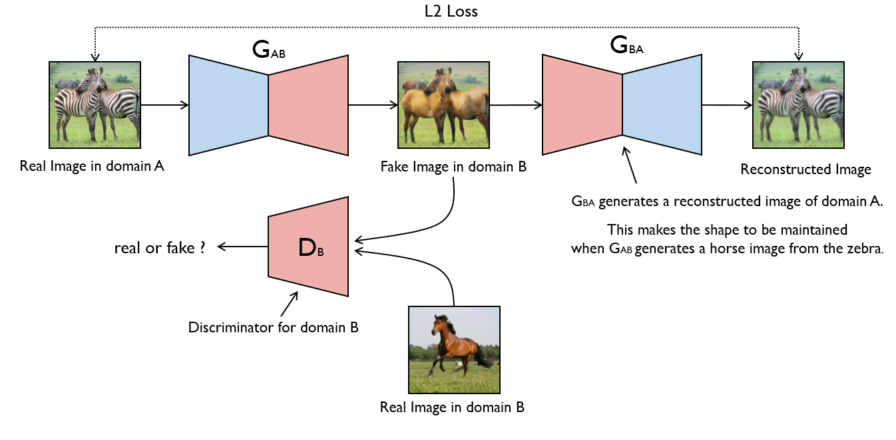
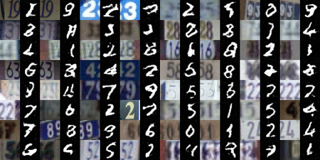
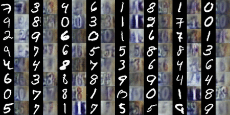
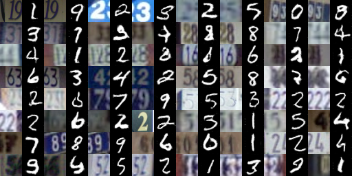
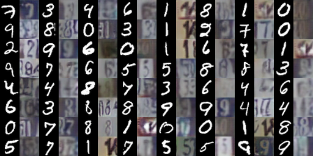
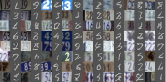
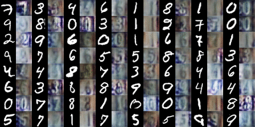
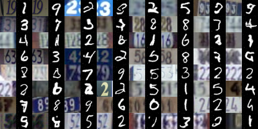
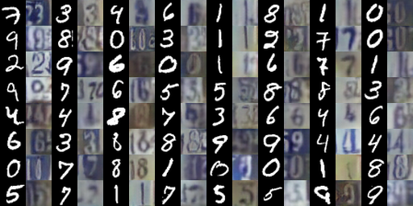

# MNIST-to-SVHN and SVHN-to-MNIST

PyTorch Implementation of [CycleGAN](https://arxiv.org/pdf/1703.10593.pdf) and [Semi-Supervised GAN](https://arxiv.org/abs/1606.01583) for Domain Transfer.




## Prerequites
* [Python 3.5](https://www.continuum.io/downloads)
* [PyTorch 0.1.12](http://pytorch.org/)


<br>

## Usage

#### Clone the repository

```bash
$ git clone https://github.com/yunjey/mnist-svhn-transfer.git
$ cd mnist-svhn-transfer/
```

#### Download the dataset
```bash
$ chmod +x download.sh
$ ./download.sh
```

#### Train the model

##### 1) CycleGAN
```bash
$ python main.py --use_labels=False --use_reconst_loss=True
```

##### 2) SGAN

```bash
$ python main.py --use_labels=True --use_reconst_loss=False
```
<br>

## Results

#### 1) CycleGAN (should be re-uploaded)

From SVHN to MNIST            |  From MNIST to SVHN
:-------------------------:|:-------------------------:
  |  
  |  

#### 2) SGAN
From SVHN to MNIST            |  From MNIST to SVHN
:-------------------------:|:-------------------------:
  |  
  |  


